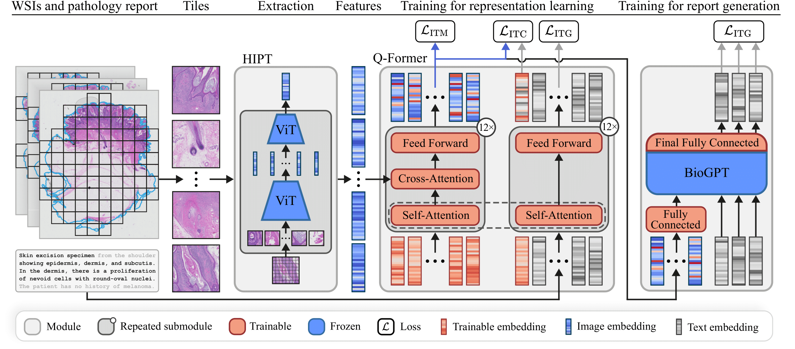

# On the Importance of Text Preprocessing for Multimodal Representation Learning and Pathology Report Generation

This repository contains all code to support the paper:

***"On the Importance of Text Preprocessing for Multimodal Representation Learning and Pathology Report Generation"***

[[`arXiv`](https://arxiv.org/pdf/2502.19285)]

<div align="center">
  
</div>

We developed a vision-language model for the pathology domain of melanocytic lesions. 
The model was trained and evaluated using a dataset of **19,636** melanocytic lesion cases, consisting of one or more whole slide images (WSIs) and a pathology report per case. 
In total, the dataset comprised of **42,433** H&E-stained WSIs and **2,132,008** words.
We built upon the [BLIP-2 framework](https://github.com/salesforce/LAVIS/tree/main/projects/blip2) using [BioGPT](https://github.com/microsoft/BioGPT) as base language model and [HIPT](https://github.com/mahmoodlab/HIPT) for WSI feature extraction.
To evaluate the model, we assessed the cross-modal retrieval performance and conducted a reader study to score the quality of the generated reports.

## Model Parameters

We provide checkpoints for both the retrieval and report generation stages. All models are available from the corresponding [HuggingFace repository](https://huggingface.co/RTLucassen/PathBLIP-2).

### 🔍 Stage 1: Retrieval Model

The retrieval model is trained with 16 queries and is used for the retrieval results presented in the paper.

- [**Retrieval Model**](https://huggingface.co/RTLucassen/PathBLIP-2/tree/main/stage_1)

### 📝 Stage 2: Report Generation Models

The final report generation models build upon the Stage 1 checkpoint trained with 64 queries and are used for the reader study results.

- [**Base Checkpoint**](https://huggingface.co/RTLucassen/PathBLIP-2/tree/main/stage_1_pretrained_stage_2)

Final Stage 2 models:

- [**Model – Full Report**](https://huggingface.co/RTLucassen/PathBLIP-2/tree/main/stage_2_full_report)  
- [**Model – H&E only**](https://huggingface.co/RTLucassen/PathBLIP-2/tree/main/stage_2_he_only)

## Citing

If you found our work useful in your research, please consider citing our paper:

```bibtex
@misc{lucassen2025importancetextpreprocessingmultimodal,
  title={On the Importance of Text Preprocessing for Multimodal Representation Learning and Pathology Report Generation}, 
  author={Lucassen, Ruben T and van de Luijtgaarden, Tijn and Moonemans, Sander P J and Breimer, Gerben E and Blokx, Willeke A M and Veta, Mitko},
  year={2025},
  eprint={2502.19285},
  archivePrefix={arXiv},
  primaryClass={cs.CV},
  url={https://arxiv.org/abs/2502.19285}
}
```
